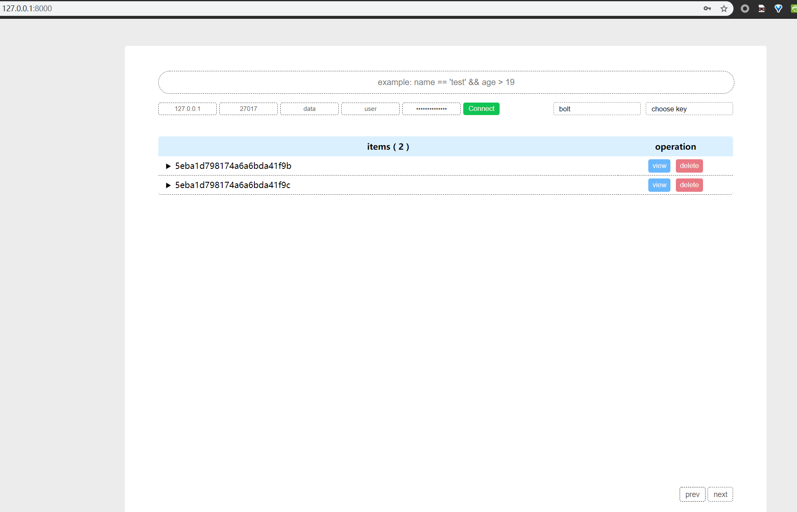
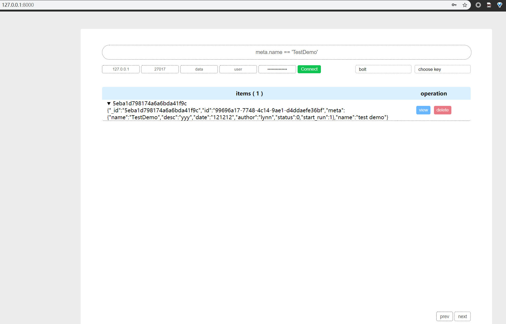
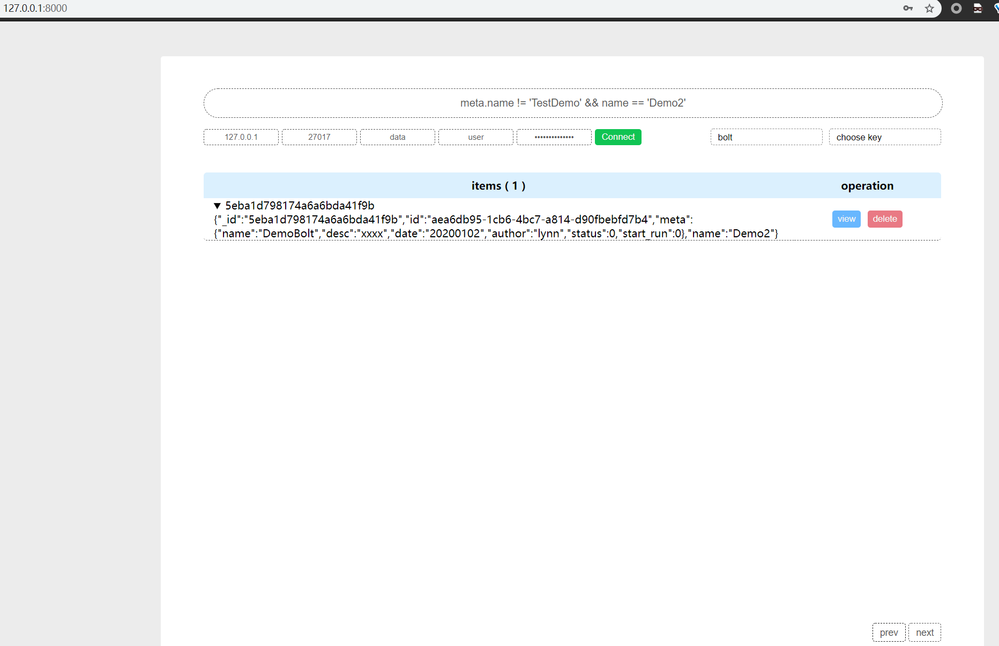

### Mongodb Web Client

#### build

```bash
docker build . -t mongo_ui:$(cat .version)
```

#### run

```bash
docker-compose up -d
```

#### doc







TODO:
- [X] ext.xxx.xxx query
- [ ] selected field table view